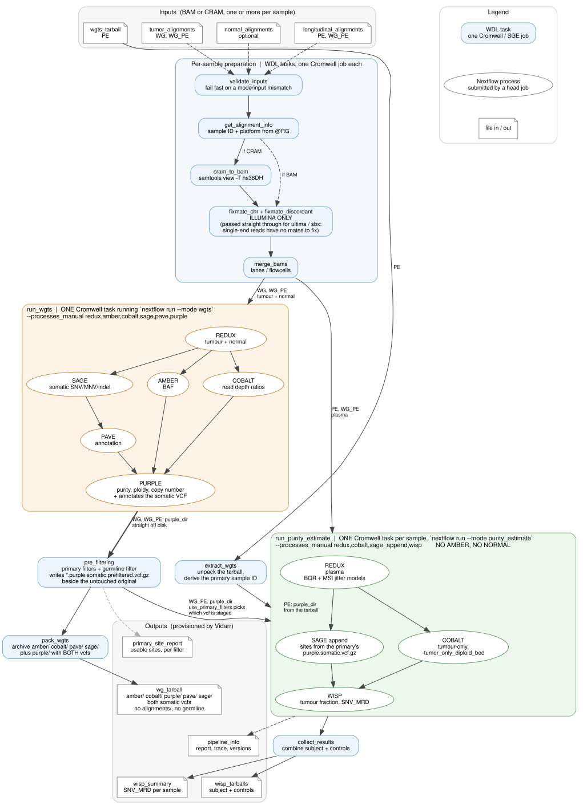

# purityEstimateV3

## Overview

Runs HMF oncoanalyser 3.0.0-rc.3 to estimate tumour purity in longitudinal ctDNA samples, for Illumina or Ultima Genomics data. In WG mode it runs WGTS (REDUX, AMBER, COBALT, SAGE, PAVE, PURPLE) on a primary tumour with an optional matched normal and produces a tarball of the results. In PE mode it runs WISP against a pre-existing WG tarball to report the ctDNA fraction of a longitudinal sample. WG_PE does both in sequence. BAM and CRAM are both accepted.



In the chart the two head-job boxes are where Cromwell stops and Nextflow starts: `run_wgts` and `run_purity_estimate` are each a SINGLE Cromwell task that runs `nextflow run`, and every process inside them is submitted to the cluster by Nextflow itself. A run directory therefore holds far fewer `call-` directories than there are tools. Diagram source is Graphviz, in docs/.

### Valid input combinations

| mode | tumor_alignments | normal_alignments | longitudinal_alignments | wgts_tarball |
|---|---|---|---|---|
| WG | required | **required** | - | - |
| PE | - | not used | required | required |
| WG_PE | required | **required** | required | - |

`normal_alignments` is used only by the WG step, for tumour/normal somatic calling, and it is REQUIRED there. Do not supply it in PE mode: the PE step does not pass the normal to WISP, so it would be staged (CRAM conversion, fixmate, merge) at real cost and then discarded. 

Normal alignments is required because without a matched normal, SAGE has no reference against which to subtract germline variants, so the primary somatic call set is dominated by germline sites. Those are present in the patient own cfDNA at heterozygous and homozygous frequencies, and WISP measures them at high VAF and reports the result as tumour fraction.

### Inputs with mixed platform (Illumina or Ultima)

oncoanalyser applies a single --sequencing_platform to a whole pipeline run and never checks it against the BAM headers, so two samples of different platforms in one run means one of them is analysed with the wrong error model, silently.

Note that a run here means one oncoanalyser (Nextflow) invocation, not one WDL job. WG_PE launches two runs, so it can legitimately span platforms: the WG run uses the primary's platform and the PE run uses the longitudinal sample's.

Platform is read per sample from the @RG PL tag; The wdl input `sequencing_platform` overrides it for data with a missing or wrong tag. Note:

* fixmate is applied only to Illumina samples. Ultima reads are single-end, and fixmate would drop every record and leave a header-only BAM.
* the WG run requires its tumour and normal to agree, and refuses to launch otherwise. `allow_mixed_platforms` overrides this, at the cost of one sample being analysed with the wrong error model.

### Note on deliverables of wdl

**Germline calls are generated but not delivered.** oncoanalyser calls germline variants whenever a matched normal is present, and this cannot be switched off from configuration. They are therefore still produced, but excluded from the WG results because MRD assay does not use them. Set `include_germline_outputs` to true to keep `sage/germline/`, `pave/germline/` and the PURPLE germline files. 

**The WG archive carries two somatic VCFs.** `<sample>.purple.somatic.vcf.gz` is PURPLE's full call set, untouched. `<sample>.purple.somatic.prefiltered.vcf.gz` is the same call set reduced to the sites that can carry MRD signal, by the primary filters (mappability, repeat count, SNV only, tier, nearby indel, subclonal) and by the germline filter that WISP documents but cannot apply, since oncoanalyser gives it no reference genotype. `primary_site_report` gives the per-filter breakdown. In PE mode `use_primary_filters` chooses which of the two the plasma stage works from; note that WISP applies the primary filters itself either way, and records the reason per site, so the prefiltered VCF is a deliverable rather than a correction.

**LOH is not available in any configuration this workflow can currently produce.** Purity therefore comes from SNVs and COBALT copy number only. 

## Dependencies

* [oncoanalyser 3.0.0-rc.3](https://github.com/nf-core/oncoanalyser)
* [nextflow 25.10.4](https://www.nextflow.io)
* [samtools 1.16.1](https://github.com/samtools/samtools)
* [hs38DH (GRCh38 full analysis set plus decoy plus HLA)](https://ftp.1000genomes.ebi.ac.uk/vol1/ftp/technical/reference/GRCh38_reference_genome/)


## Usage

### Cromwell
```
java -jar cromwell.jar run purityEstimateV3.wdl --inputs inputs.json
```

### Inputs

#### Required workflow parameters:
Parameter|Value|Description
---|---|---
`mode`|String|Run mode: WG=WGTS only; PE=purity estimation against a pre-existing WG tarball; WG_PE=run both sequentially
`group_id`|String|Sample group identifier used as the output subdirectory name and samplesheet group_id
`subject_id`|String|Subject/patient identifier
`outputFileNamePrefix`|String|Output directory prefix; the pipeline writes to outputFileNamePrefix/group_id/


#### Optional workflow parameters:
Parameter|Value|Default|Description
---|---|---|---
`tumor_alignments`|Array[Alignment]?|None|Primary tumour BAM/CRAM(s) with indices; required for WG and WG_PE mode. Multiple entries (e.g. per flowcell) are merged
`normal_alignments`|Array[Alignment]?|None|Matched normal BAM/CRAM(s) with indices. MANDATORY for WG and WG_PE, with no override: without it the primary is called tumour-only, germline variants are not subtracted from the somatic call set, and the MRD result is a false positive. Not used by the PE step, which does not pass the normal to WISP; supplying it in PE mode wastes staging effort
`longitudinal_alignments`|Array[Alignment]?|None|ctDNA BAM/CRAM(s) with indices; required for PE and WG_PE mode. Multiple entries are merged
`wgts_tarball`|File?|None|Tarball produced by a prior WG run (amber/, cobalt/, purple/, pave/, sage/); required for PE mode
`tumor_sample_id`|String?|None|Primary tumour sample ID. Normally leave unset: in WG modes it is read from the tumour @RG SM tag, and in PE mode it is derived from the WG tarball's purple/ filenames. If given, it overrides the @RG SM tag in WG modes and is cross-checked against the tarball in PE mode
`sequencing_platform`|String?|None|Sequencing platform passed to --sequencing_platform: illumina, sbx or ultima. Leave unset to detect it from the @RG PL tag
`run_redux`|Boolean|false|When true, REDUX processes the alignments normally. When false, inputs are treated as already REDUX-processed and REDUX only regenerates its TSVs (-bqr_jitter_msi_only). Does not affect control BAMs
`run_control`|Boolean|false|When true, also run purity estimation for each control BAM in the controls array (PE/WG_PE mode only)
`controls`|Array[Pair[String,String]]?|None|PE mode: array of (control_id, bam_path) pairs; BAI assumed at bam_path+'.bai'. Controls are BAM only and always run with run_redux=false; used only when run_control=true
`include_germline_outputs`|Boolean|false|Whether to keep germline variant calls in the WG archive. Defaults false: germline calls play no part in MRD, since WISP reads the PURPLE somatic VCF and upstream purity_estimate.nf disables germline calling itself. Note they are still GENERATED -- oncoanalyser hardcodes germline calling on and it cannot be disabled from configuration -- so this drops sage/germline, pave/germline and the PURPLE germline files from the archive rather than skipping the work
`allow_mixed_platforms`|Boolean|false|Guardrail. oncoanalyser applies ONE --sequencing_platform per pipeline run, so two samples of different platforms in the same run means one of them gets the wrong error model. Left false (the production default) such a combination fails before Nextflow starts. Set true only for deliberate experiments: the run proceeds with a loud warning
`use_primary_filters`|Boolean|true|PE and WG_PE mode: whether the plasma stage works from the prefiltered primary VCF rather than the full call set. The WG stage always writes both, so this only chooses between them. A WG tarball produced before pre-filtering existed contains no prefiltered VCF; the run then falls back to the full set with a warning rather than failing
`nextflow_stub`|Boolean|false|When true, oncoanalyser runs with -stub --create_stub_placeholders: every process writes placeholder outputs instead of doing real work. This exercises the whole wrapper (samplesheet, samplesheet validation, output layout, tarring, Vidarr outputs) in minutes. Real input alignments are still required, but they can be tiny, because the pipeline never reads them. Not a Cromwell dry run
`modules`|String|"java/17 singularity/3.9.4 samtools/1.16.1 oncoanalyser/3.0.0-rc.3 oncoanalyser-data/3.0.0"|Environment modules to load. The oncoanalyser module supplies the pipeline checkout, the container image cache, NEXTFLOW_HOME, the scheduler submit wrapper, the site config overlay and the Nextflow launcher; the oncoanalyser-data module supplies the reference bundle. The resource paths below read variables exported by both, so the module versions here and those paths must stay in step


#### Optional task parameters:
Parameter|Value|Default|Description
---|---|---|---
`validate_inputs.memory`|Int|1|Memory in GB
`validate_inputs.timeout`|Int|1|Wall-clock timeout in hours
`tumor_info.modules`|String|"samtools/1.16.1"|Environment modules to load (samtools required)
`tumor_info.memory`|Int|4|Memory in GB
`tumor_info.timeout`|Int|1|Wall-clock timeout in hours
`normal_info.modules`|String|"samtools/1.16.1"|Environment modules to load (samtools required)
`normal_info.memory`|Int|4|Memory in GB
`normal_info.timeout`|Int|1|Wall-clock timeout in hours
`longitudinal_info.modules`|String|"samtools/1.16.1"|Environment modules to load (samtools required)
`longitudinal_info.memory`|Int|4|Memory in GB
`longitudinal_info.timeout`|Int|1|Wall-clock timeout in hours
`cram_tumor.modules`|String|"samtools/1.16.1 oncoanalyser-data/3.0.0"|Environment modules to load. samtools is required; oncoanalyser-data supplies $VENDOR_GENOME_HS38DH for cram_reference
`cram_tumor.threads`|Int|8|Number of samtools threads
`cram_tumor.memory`|Int|16|Memory in GB
`cram_tumor.timeout`|Int|24|Wall-clock timeout in hours
`fixmate_tumor_chr.modules`|String|"samtools/1.16.1"|Environment modules to load (samtools required)
`fixmate_tumor_chr.threads`|Int|4|Number of samtools threads
`fixmate_tumor_chr.memory`|Int|16|Memory in GB
`fixmate_tumor_chr.timeout`|Int|4|Wall-clock timeout in hours
`fixmate_tumor_disc.modules`|String|"samtools/1.16.1"|Environment modules to load (samtools required)
`fixmate_tumor_disc.threads`|Int|4|Number of samtools threads
`fixmate_tumor_disc.memory`|Int|16|Memory in GB
`fixmate_tumor_disc.timeout`|Int|3|Wall-clock timeout in hours
`merge_tumor_fixmate.modules`|String|"samtools/1.16.1"|Environment modules to load (samtools required)
`merge_tumor_fixmate.threads`|Int|8|Number of samtools threads
`merge_tumor_fixmate.memory`|Int|16|Memory in GB
`merge_tumor_fixmate.timeout`|Int|24|Wall-clock timeout in hours
`merge_tumor_plain.modules`|String|"samtools/1.16.1"|Environment modules to load (samtools required)
`merge_tumor_plain.threads`|Int|8|Number of samtools threads
`merge_tumor_plain.memory`|Int|16|Memory in GB
`merge_tumor_plain.timeout`|Int|24|Wall-clock timeout in hours
`cram_normal.modules`|String|"samtools/1.16.1 oncoanalyser-data/3.0.0"|Environment modules to load. samtools is required; oncoanalyser-data supplies $VENDOR_GENOME_HS38DH for cram_reference
`cram_normal.threads`|Int|8|Number of samtools threads
`cram_normal.memory`|Int|16|Memory in GB
`cram_normal.timeout`|Int|24|Wall-clock timeout in hours
`fixmate_normal_chr.modules`|String|"samtools/1.16.1"|Environment modules to load (samtools required)
`fixmate_normal_chr.threads`|Int|4|Number of samtools threads
`fixmate_normal_chr.memory`|Int|16|Memory in GB
`fixmate_normal_chr.timeout`|Int|4|Wall-clock timeout in hours
`fixmate_normal_disc.modules`|String|"samtools/1.16.1"|Environment modules to load (samtools required)
`fixmate_normal_disc.threads`|Int|4|Number of samtools threads
`fixmate_normal_disc.memory`|Int|16|Memory in GB
`fixmate_normal_disc.timeout`|Int|3|Wall-clock timeout in hours
`merge_normal_fixmate.modules`|String|"samtools/1.16.1"|Environment modules to load (samtools required)
`merge_normal_fixmate.threads`|Int|8|Number of samtools threads
`merge_normal_fixmate.memory`|Int|16|Memory in GB
`merge_normal_fixmate.timeout`|Int|24|Wall-clock timeout in hours
`merge_normal_plain.modules`|String|"samtools/1.16.1"|Environment modules to load (samtools required)
`merge_normal_plain.threads`|Int|8|Number of samtools threads
`merge_normal_plain.memory`|Int|16|Memory in GB
`merge_normal_plain.timeout`|Int|24|Wall-clock timeout in hours
`cram_longitudinal.modules`|String|"samtools/1.16.1 oncoanalyser-data/3.0.0"|Environment modules to load. samtools is required; oncoanalyser-data supplies $VENDOR_GENOME_HS38DH for cram_reference
`cram_longitudinal.threads`|Int|8|Number of samtools threads
`cram_longitudinal.memory`|Int|16|Memory in GB
`cram_longitudinal.timeout`|Int|24|Wall-clock timeout in hours
`fixmate_longitudinal_chr.modules`|String|"samtools/1.16.1"|Environment modules to load (samtools required)
`fixmate_longitudinal_chr.threads`|Int|4|Number of samtools threads
`fixmate_longitudinal_chr.memory`|Int|16|Memory in GB
`fixmate_longitudinal_chr.timeout`|Int|4|Wall-clock timeout in hours
`fixmate_longitudinal_disc.modules`|String|"samtools/1.16.1"|Environment modules to load (samtools required)
`fixmate_longitudinal_disc.threads`|Int|4|Number of samtools threads
`fixmate_longitudinal_disc.memory`|Int|16|Memory in GB
`fixmate_longitudinal_disc.timeout`|Int|3|Wall-clock timeout in hours
`merge_longitudinal_fixmate.modules`|String|"samtools/1.16.1"|Environment modules to load (samtools required)
`merge_longitudinal_fixmate.threads`|Int|8|Number of samtools threads
`merge_longitudinal_fixmate.memory`|Int|16|Memory in GB
`merge_longitudinal_fixmate.timeout`|Int|24|Wall-clock timeout in hours
`merge_longitudinal_plain.modules`|String|"samtools/1.16.1"|Environment modules to load (samtools required)
`merge_longitudinal_plain.threads`|Int|8|Number of samtools threads
`merge_longitudinal_plain.memory`|Int|16|Memory in GB
`merge_longitudinal_plain.timeout`|Int|24|Wall-clock timeout in hours
`run_wgts.memory`|Int|32|Memory in GB for this task, which hosts the Nextflow driver only; the pipeline processes get their own allocations
`run_wgts.timeout`|Int|24|Wall-clock timeout in hours
`extract_wgts.memory`|Int|8|Memory in GB
`extract_wgts.timeout`|Int|1|Wall-clock timeout in hours
`pre_filtering.modules`|String|"bcftools/1.9"|Environment modules to load (bcftools required)
`pre_filtering.memory`|Int|4|Memory in GB
`pre_filtering.timeout`|Int|2|Wall-clock timeout in hours
`pack_wgts.memory`|Int|8|Memory in GB
`pack_wgts.timeout`|Int|4|Wall-clock timeout in hours
`subject_purity.memory`|Int|32|Memory in GB for this task, which hosts the Nextflow driver only; the pipeline processes get their own allocations
`subject_purity.timeout`|Int|10|Wall-clock timeout in hours
`control_info.modules`|String|"samtools/1.16.1"|Environment modules to load (samtools required)
`control_info.memory`|Int|4|Memory in GB
`control_info.timeout`|Int|1|Wall-clock timeout in hours
`control_purity.memory`|Int|32|Memory in GB for this task, which hosts the Nextflow driver only; the pipeline processes get their own allocations
`control_purity.timeout`|Int|10|Wall-clock timeout in hours
`collect_results.memory`|Int|16|Memory in GB
`collect_results.timeout`|Int|10|Wall-clock timeout in hours


### Outputs

Output | Type | Description | Labels
---|---|---|---
`wg_tarball`|File?|Tarball of oncoanalyser WGTS outputs (amber/, cobalt/, purple/, pave/, sage/) for the primary tumour sample; produced in WG and WG_PE mode. Used as the wgts_tarball input for a subsequent PE run. REDUX alignments are deliberately excluded to keep the archive small.|vidarr_label: wgTarball
`wisp_tarballs`|File?|Combined tarball of WISP output directories for the subject longitudinal sample and all control samples; produced in PE and WG_PE mode.|vidarr_label: wispTarballs
`wisp_summary`|File?|TSV file with one header row and one data row per sample (subject + controls) showing the WISP-estimated ctDNA purity fraction; produced in PE and WG_PE mode.|vidarr_label: wispSummary
`primary_site_report`|File?|Plain-text report of the primary tumour's variant list: how many candidate sites survive each filter in turn, primary filters and the germline filter alike. The final count is the number of sites available for MRD assessment, which is what says whether a plasma sample is worth taking. Produced in WG and WG_PE mode.|vidarr_label: primarySiteReport
`pipeline_info`|File|Tarball of the Nextflow pipeline_info/ directory (execution report, timeline, trace, DAG, params JSON, software versions); always produced. In WG_PE mode the PE run's copy is used.|vidarr_label: pipelineInfo


## Commands
This section lists command(s) run by purityEstimateV3 workflow

* Running purityEstimateV3

```
      set -euo pipefail
      # Bind interpolated values to shell variables: WDL substitutes them at generation
      # time, so testing them directly produces a script full of constant comparisons.
      mode="~{mode}"
      errors=()

      case "${mode}" in
        WG)
          ~{if has_tumor then "true" else "false"} || errors+=("mode WG requires tumor_alignments")
          ;;
        WG_PE)
          ~{if has_tumor then "true" else "false"} || errors+=("mode WG_PE requires tumor_alignments")
          ~{if has_longitudinal then "true" else "false"} || errors+=("mode WG_PE requires longitudinal_alignments")
          ;;
        PE)
          ~{if has_longitudinal then "true" else "false"} || errors+=("mode PE requires longitudinal_alignments")
          ~{if has_wgts_tarball then "true" else "false"} || errors+=("mode PE requires wgts_tarball from a prior WG run")
          ;;
        *)
          errors+=("mode must be WG, PE or WG_PE, got '${mode}'")
          ;;
      esac

      if ~{run_control}; then
        ~{if has_controls then "true" else "false"} || errors+=("run_control=true requires the controls array")
        case "${mode}" in
          PE|WG_PE) ;;
          *) errors+=("run_control is only meaningful in PE or WG_PE mode") ;;
        esac
      fi

      # A tumour-only primary does not merely degrade the MRD result, it INVERTS it. With no
      # matched normal SAGE cannot subtract germline variants, so the somatic call set is
      # dominated by germline sites; those sit in the patient's own cfDNA at heterozygous and
      # homozygous frequencies, and WISP reports that as tumour fraction. Unconditional hard
      # error, no override: a tumour-only primary has no legitimate use here.
      if [ "${mode}" != "PE" ] && ~{if has_normal then "false" else "true"}; then
        errors+=("mode ${mode} requires normal_alignments: without a matched normal the primary is called tumour-only, germline variants are not subtracted, and WISP reports a FALSE MRD-POSITIVE. There is deliberately no override")
      fi

      if [ "${#errors[@]}" -gt 0 ]; then
        echo "ERROR: inputs do not satisfy mode ${mode}:" >&2
        for e in "${errors[@]}"; do
          echo "  - ${e}" >&2
        done
        exit 1
      fi

      if [ "${mode}" = "PE" ] && ~{if has_normal then "true" else "false"}; then
        {
          echo "note: normal_alignments is not used in PE mode. The PE run processes only the"
          echo "      longitudinal sample, so the normal would be staged (CRAM conversion,"
          echo "      fixmate, merge) at real cost and then discarded. Omit it."
        } >&2
      fi

      echo "inputs OK for mode ${mode}"
```
```
      set -euo pipefail
      samtools view -H ~{aln_path} > header.txt

      # Sample ID from the first @RG SM tag.
      awk '/^@RG/{for(i=1;i<=NF;i++) if($i~/^SM:/){sub(/^SM:/,"",$i); print $i; exit}}' \
        header.txt > sample_id.txt
      [ -s sample_id.txt ] || { echo "ERROR: no @RG SM tag in ~{aln_path}" >&2; exit 1; }

      # Refuse a file carrying several different samples: taking the first SM would be wrong.
      distinct=$(awk '/^@RG/{for(i=1;i<=NF;i++) if($i~/^SM:/) print $i}' header.txt | sort -u | wc -l)
      if [ "${distinct}" -ne 1 ]; then
        echo "ERROR: ${distinct} distinct @RG SM values in ~{aln_path}; expected exactly 1" >&2
        exit 1
      fi

      # Platform from @RG PL, lowercased to match --sequencing_platform (ULTIMA -> ultima).
      # Absent PL is treated as Illumina, which is also oncoanalyser's own default.
      awk '/^@RG/{for(i=1;i<=NF;i++) if($i~/^PL:/){sub(/^PL:/,"",$i); print tolower($i); exit}}' \
        header.txt > platform.txt
      [ -s platform.txt ] || echo illumina > platform.txt
```
```
      set -euo pipefail
      # Cromwell localizes the CRAM and its index into different directories, so symlink
      # both here with matching basenames for samtools to find the index.
      ln -s ~{aln} ./input.cram
      ln -s ~{idx} ./input.cram.crai

      [ -s "~{cram_reference}" ] || {
        echo "ERROR: CRAM reference not readable: ~{cram_reference}" >&2
        exit 1
      }

      samtools view -@ ~{threads} -T ~{cram_reference} -b -o converted.bam ./input.cram
      samtools index -@ ~{threads} converted.bam
```
```
      set -euo pipefail
      # Symlink BAM and BAI preserving the original filenames so samtools can
      # locate the index automatically (it derives the index path from the BAM
      # path; renaming would break that lookup).
      ln -s ~{bam} .
      ln -s ~{bai} .
      bam_name=$(basename ~{bam})
      samtools view -h -@ 2 "${bam_name}" ~{chr} \
        | awk '/^@/{print;next} $7=="="' \
        | samtools sort -n -u -@ 2 -m 1G - \
        | samtools fixmate -m -u -@ 2 - - \
        | samtools sort -@ ~{threads} -m 2G -o ~{chr}.fixedmate.bam -
      samtools index ~{chr}.fixedmate.bam
```
```
      set -euo pipefail
      # -f 1:  paired
      # -F 12: neither read nor mate unmapped
      # awk:   keep header lines and reads where mate is on a different chromosome
      # No index needed: full-file sequential scan.
      samtools view -h -@ 2 -f 1 -F 12 ~{bam} \
        | awk '/^@/{print;next} $7!="="' \
        | samtools sort -n -u -@ 2 -m 1G - \
        | samtools fixmate -m -u -@ 2 - - \
        | samtools sort -@ ~{threads} -m 2G -o discordant.fixedmate.bam -
      samtools index discordant.fixedmate.bam
```
```
      set -euo pipefail
      bam_list=(~{sep=" " bams})

      merge_stream() {
        if [ "${#bam_list[@]}" -gt 1 ]; then
          samtools merge -f -c -p -u -@ ~{threads} - "${bam_list[@]}"
        else
          samtools view -h -u "${bam_list[0]}"
        fi
      }

      # @PG stripping: an aligner may embed tab-separated fields in CL:, which makes htsjdk
      # read a spurious second ID: field and reject the header.
      # Flag fix: per-chromosome fixmate may clear 0x1 while leaving 0x40/0x80 set on
      # discordant-mate reads; htsjdk treats this as a validation error.
      if ~{sanitize_header}; then
        merge_stream \
          | samtools view -h -@ ~{threads} \
          | awk 'BEGIN{OFS="\t"} /^@PG/{next} /^@/{print;next} {
              f=int($2)
              if (and(f,1)==0) { f=f-and(f,64)-and(f,128); $2=f }
              print
            }' \
          | samtools view -@ ~{threads} -O BAM -o merged.bam
      else
        merge_stream | samtools view -@ ~{threads} -O BAM -o merged.bam
      fi

      samtools index -@ ~{threads} merged.bam
```
```
      set -euo pipefail
      mkdir -p wgts_extracted
      tar -xzf ~{tarball} -C wgts_extracted/
      echo "$(pwd)/wgts_extracted" > output_dir.txt

      # Derive the primary tumour sample ID from the PURPLE filenames rather than trusting a
      # hand-typed input. SAGE_APPEND reads <tumor_sample_id>.purple.somatic.vcf.gz, so a wrong
      # ID would fail only after the expensive steps have run. The WG step names these files
      # from the tumour @RG SM tag, which is rarely the same string as group_id.
      shopt -s nullglob
      ids=()
      for f in wgts_extracted/purple/*.purple.purity.tsv; do
        ids+=("$(basename "$f" .purple.purity.tsv)")
      done

      if [ "${#ids[@]}" -ne 1 ]; then
        echo "ERROR: expected exactly one *.purple.purity.tsv under purple/, found ${#ids[@]}" >&2
        printf '  %s\n' "${ids[@]+${ids[@]}}" >&2
        exit 1
      fi

      tumor_sample_id="${ids[0]}"
      echo "${tumor_sample_id}" > tumor_sample_id.txt

      # SAGE_APPEND needs this specific file; check now, not an hour in.
      vcf="wgts_extracted/purple/${tumor_sample_id}.purple.somatic.vcf.gz"
      if [ ! -s "${vcf}" ]; then
        echo "ERROR: tarball has no ${vcf}, which SAGE_APPEND requires" >&2
        exit 1
      fi

      expected="~{expected_tumor_sample_id}"
      if [ -n "${expected}" ] && [ "${expected}" != "${tumor_sample_id}" ]; then
        echo "ERROR: tumor_sample_id '${expected}' does not match the WG outputs, which are" >&2
        echo "       named for '${tumor_sample_id}'. Omit tumor_sample_id to use the value" >&2
        echo "       derived from the tarball." >&2
        exit 1
      fi

      echo "primary tumour sample ID: ${tumor_sample_id}"
```
```
      set -euo pipefail

      SRC="~{purple_dir}"
      TUMOR="~{tumor_sample_id}"
      VCF_NAME="${TUMOR}.purple.somatic.vcf.gz"
      PREFILTERED_NAME="${TUMOR}.purple.somatic.prefiltered.vcf.gz"
      SRC_VCF="${SRC}/${VCF_NAME}"
      DEST="$(pwd)/purple_prefiltered"
      REPORT="~{outputFileNamePrefix}.primary_site_report.txt"
      : > "${REPORT}"

      # Anything that stops us filtering is reported and then ignored: an unusable VCF must
      # not take down a run that would otherwise have produced a result. The caller falls
      # back to the unfiltered directory.
      give_up() {
        echo "NOTE: pre-filtering skipped: $1" >&2
        { echo "prefiltering: SKIPPED"; echo "reason: $1"; } >> "${REPORT}"
        echo "-1" > usable_sites.txt
        echo "0"  > germline_removed.txt
        echo "${SRC}" > purple_dir_out.txt
        exit 0
      }

      [ -s "${SRC_VCF}" ] || give_up "no ${VCF_NAME} in ${SRC}"

      # Sample columns resolved BY NAME, never by position. If the columns are the other way
      # round a hardcoded index tests the tumour instead of the normal, which removes the
      # entire call set and yields a confident MRD-negative with no error anywhere.
      mapfile -t SAMPLES < <(bcftools query -l "${SRC_VCF}")
      [ "${#SAMPLES[@]}" -eq 2 ] || give_up "expected 2 samples in ${VCF_NAME}, found ${#SAMPLES[@]}"
      TUM_IDX=""; NORM_IDX=""
      for i in 0 1; do
        if [ "${SAMPLES[$i]}" = "${TUMOR}" ]; then TUM_IDX=$i; NORM_IDX=$((1 - i)); fi
      done
      [ -n "${TUM_IDX}" ] || give_up "tumour '${TUMOR}' not among VCF samples: ${SAMPLES[*]}"

      HDR=$(bcftools view -h "${SRC_VCF}")
      has() { grep -q "^##$1=<ID=$2," ```"${HDR}"; }

      # The quality field has been renamed across hmftools versions. ARCBQ is the name the
      # WISP filter is documented against and what current SAGE emits; ABQ is the older
      # equivalent and is still what externally supplied VCFs may carry. RABQ is
      # deliberately NOT accepted: it is the raw, pre-recalibration value, so applying the
      # threshold to it would filter on the wrong quantity. Better to skip the filter and
      # say so than to apply it to a field that does not mean what the threshold assumes.
      QUAL=""
      if has FORMAT ARCBQ; then QUAL=ARCBQ; elif has FORMAT ABQ; then QUAL=ABQ; fi
      REPC_FIELDS=()
      has INFO RC_REPC && REPC_FIELDS+=(RC_REPC)
      has INFO REP_C   && REPC_FIELDS+=(REP_C)

      GERMLINE_EXPR=""
      if [ -n "${QUAL}" ]; then
        GERMLINE_EXPR="(FORMAT/AD[${NORM_IDX}:1]/FORMAT/DP[${NORM_IDX}]) > 0.01 & FORMAT/${QUAL}[${NORM_IDX}:1] > 30"
      fi

      # tag|mode|expression. mode i = flag when the expression is FALSE, e = flag when TRUE.
      # The germline filter has to be an exclude: bcftools cannot negate an indexed FORMAT
      # expression. Tags are what land in the VCF FILTER column, so they are uppercase and
      # match the condition names the WISP documentation uses.
      FILTERS=()
      has INFO MAPPABILITY  && FILTERS+=("MAPPABILITY|i|INFO/MAPPABILITY>=0.5")
      for rf in "${REPC_FIELDS[@]+"${REPC_FIELDS[@]}"}"; do
        FILTERS+=("${rf}|i|INFO/${rf}<4 || INFO/${rf}==\".\"")
      done
      FILTERS+=("NON_SNV|i|TYPE=\"snp\"")
      has INFO TIER         && FILTERS+=("LOW_CONFIDENCE|i|INFO/TIER!=\"LOW_CONFIDENCE\"")
      has INFO NEARBY_INDEL && FILTERS+=("NEARBY_INDEL|i|INFO/NEARBY_INDEL=0")
      if has INFO SUBCL && has INFO PURPLE_VCN; then
        FILTERS+=("SUBCLONAL|i|INFO/SUBCL<=0.5 || INFO/PURPLE_VCN>=0.7")
      fi
      [ -n "${GERMLINE_EXPR}" ] && FILTERS+=("GERMLINE|e|${GERMLINE_EXPR}")

      {
        echo "primary sample: ${TUMOR}"
        echo "vcf:            ${VCF_NAME}"
        echo "samples:        [0]=${SAMPLES[0]} [1]=${SAMPLES[1]}"
        echo "normal column:  ${NORM_IDX} (${SAMPLES[$NORM_IDX]})"
        echo "qual field:     ${QUAL:-NONE, germline filter not applied}"
        echo "repeat fields:  ${REPC_FIELDS[*]+"${REPC_FIELDS[*]}"}"
        echo
        echo "Two of WISP's conditions are measurements on the cfDNA sample and cannot be"
        echo "evaluated here: average edge distance (AED[1] >= 0.06) and the quality ratio"
        echo "(RC_QUAL[0]+[1]+[3])/(RC_CNT[0]+[1]+[3]) >= 18. WISP applies both itself, so the"
        echo "count below is an upper bound on the sites it will actually use."
        echo
        printf '%-16s %10s %10s\n' "filter" "remaining" "lost"
      } >> "${REPORT}"

      WORK=$(mktemp -d)
      TOTAL=$(bcftools view -H "${SRC_VCF}" | wc -l)
      printf '%-16s %10s %10s\n' "(total)" "${TOTAL}" "-" >> "${REPORT}"

      # Only this first step DROPS records. Everything after it SOFT-FLAGS: the record set is
      # fixed here and later steps only add tags to the FILTER column, so the delivered VCF
      # says per site which conditions it failed instead of silently omitting it. A consumer
      # selects FILTER="PASS" to get the usable subset, which is also what WISP does with
      # whatever VCF it is given.
      bcftools view -i 'FILTER="PASS"' -Oz -o "${WORK}/cur.vcf.gz" "${SRC_VCF}"
      bcftools index -t -f "${WORK}/cur.vcf.gz"
      PREV=$(bcftools view -H "${WORK}/cur.vcf.gz" | wc -l)
      KEPT=${PREV}
      printf '%-16s %10s %10s\n' "PASS" "${PREV}" "$(( TOTAL - PREV ))" >> "${REPORT}"

      GERMLINE_LOST=""
      for entry in "${FILTERS[@]}"; do
        tag="${entry%%|*}"; rest="${entry#*|}"; mode="${rest%%|*}"; expr="${rest#*|}"
        # A field can exist in the header and still be unusable by this bcftools build, so
        # a failing expression is reported and skipped rather than killing the run.
        if ! bcftools filter -s "${tag}" -m + "-${mode}" "${expr}" \
             -Oz -o "${WORK}/next.vcf.gz" "${WORK}/cur.vcf.gz" 2>"${WORK}/err"; then
          printf '%-16s %10s %10s\n' "${tag}" "SKIPPED" "$(head -1 "${WORK}/err" | cut -c1-40)" >> "${REPORT}"
          continue
        fi
        mv "${WORK}/next.vcf.gz" "${WORK}/cur.vcf.gz"
        bcftools index -t -f "${WORK}/cur.vcf.gz"
        # "remaining" is how many records are still PASS, not how many are left in the file.
        n=$(bcftools view -H -i 'FILTER="PASS"' "${WORK}/cur.vcf.gz" | wc -l)
        printf '%-16s %10s %10s\n' "${tag}" "${n}" "$(( PREV - n ))" >> "${REPORT}"

        if [ "${tag}" = "GERMLINE" ]; then GERMLINE_LOST=$(( PREV - n )); fi
        PREV=${n}
      done
      USABLE=${PREV}
      echo "${USABLE}" > usable_sites.txt
      echo "${GERMLINE_LOST:-0}" > germline_removed.txt

      # Copy rather than write in place: the source is another task's output or a tarball
      # extraction, and neither may be mutated.
      mkdir -p "${DEST}"
      cp -r "${SRC}/." "${DEST}/"
      cp "${WORK}/cur.vcf.gz" "${DEST}/${PREFILTERED_NAME}"
      bcftools index -t -f "${DEST}/${PREFILTERED_NAME}"
      echo "${DEST}" > purple_dir_out.txt

      { echo
        echo "sites usable for MRD: ${USABLE} of ${TOTAL}"
        echo "written as ${PREFILTERED_NAME}, alongside the unmodified ${VCF_NAME}."
        echo "That file holds all ${KEPT} PASS-in-purple records; the ones that failed a"
        echo "condition carry it in the FILTER column rather than being dropped, so select"
        echo "FILTER=\"PASS\" for the ${USABLE} usable sites."
      } >> "${REPORT}"

      rm -rf "${WORK}"
      cat "${REPORT}" >&2
```
```
      set -euo pipefail
      # Stage symlinks and dereference them into the archive, so the WG output is not copied
      # a second time. alignments/ is excluded on purpose: it holds full REDUX BAMs, and a
      # chained PE run reads the primary outputs from disk rather than from this archive.
      stage="$(pwd)/stage"
      mkdir -p "${stage}"

      # Collect only the directories that exist, so a run that legitimately produces fewer
      # of them does not fail at the very last step after hours of compute.
      tar_dirs=()
      for d in amber cobalt pave sage; do
        if [ -d "~{wgts_dir}/${d}" ]; then
          ln -s "~{wgts_dir}/${d}" "${stage}/${d}"
          tar_dirs+=("${d}/")
        else
          echo "note: ${d}/ not present in the output, omitting from the archive" >&2
        fi
      done
      if [ -d "~{purple_dir}" ]; then
        ln -s "~{purple_dir}" "${stage}/purple"
        tar_dirs+=("purple/")
      else
        echo "note: purple/ not present, omitting from the archive" >&2
      fi
      if [ "${#tar_dirs[@]}" -eq 0 ]; then
        echo "ERROR: none of amber/ cobalt/ purple/ pave/ sage/ were produced" >&2
        exit 1
      fi

      # Germline calls are not part of the MRD deliverable and WISP does not use them, so
      # they are dropped from the archive. They ARE still generated: oncoanalyser hardcodes
      # germline calling on and it cannot be switched off from configuration.
      # The pattern catches sage/germline/, pave/germline/ and the PURPLE germline files.
      exclude_args=()
      if ! ~{include_germline_outputs}; then
        exclude_args=(--exclude='*germline*')
      fi

      # -h dereferences the staged symlinks; without it the archive holds four links.
      tar -czhf ~{outputFileNamePrefix}.wgts.tar.gz \
          "${exclude_args[@]}" \
          -C "${stage}" \
          "${tar_dirs[@]}"
```
```
        set -euo pipefail

        ## concatenate the summaries
        cat ~{subject_summary} > ~{outputFileNamePrefix}.wisp_summary.tsv
        for f in ~{sep=" " control_summaries}
        do
            tail -n1 $f >> ~{outputFileNamePrefix}.wisp_summary.tsv
        done

        ## retar the tarballs
        mkdir -p wisp
        for tgz in ~{subject_tarball} ~{sep=" " control_tarballs}
        do
            tar -xvf $tgz -C wisp/ --strip-components=1
        done
        tar -cvzf ~{outputFileNamePrefix}.wisp.tar.gz wisp/*
```
```
      set -euo pipefail
      mkdir -p ~{outdir}
      abs_outdir=$(readlink -f ~{outdir})

      WORKDIR=$(pwd)

      # Optional inputs render as the empty string when absent, so capture them in shell
      # variables and branch on those rather than testing the interpolation directly.
      normal_bam="~{normal_bam}"
      normal_bai="~{normal_bai}"
      normal_sample_id="~{normal_sample_id}"
      normal_platform="~{normal_platform}"

      # This run processes the tumour AND the normal, but oncoanalyser applies ONE
      # --sequencing_platform per run, so a tumour/normal pair split across platforms would
      # get the wrong error model applied to one of them. There is no way to drop the normal
      # from a tumour/normal analysis, so refuse unless explicitly overridden.
      if [ -n "${normal_platform}" ] && [ "${normal_platform}" != "~{sequencing_platform}" ]; then
        {
          echo "mixed sequencing platforms within a SINGLE oncoanalyser run:"
          echo "  this run uses --sequencing_platform ~{sequencing_platform}"
          echo "  but the normal sample is ${normal_platform}"
        } >&2
        if ~{allow_mixed_platforms}; then
          echo "WARNING: proceeding because allow_mixed_platforms=true; results for the" >&2
          echo "         ${normal_platform} sample are not trustworthy." >&2
        else
          {
            echo "REFUSING TO LAUNCH. Use a tumour/normal pair from one platform, or set"
            echo "allow_mixed_platforms=true for a deliberate experiment."
          } >&2
          exit 1
        fi
      fi

      ln -s "~{tumor_bam}" "${WORKDIR}/~{tumor_sample_id}.bam"
      ln -s "~{tumor_bai}" "${WORKDIR}/~{tumor_sample_id}.bam.bai"
      if [ -n "${normal_bam}" ]; then
        ln -s "${normal_bam}" "${WORKDIR}/${normal_sample_id}.bam"
        ln -s "${normal_bai}" "${WORKDIR}/${normal_sample_id}.bam.bai"
      fi

      # run_redux=false means "these are already REDUX alignments". REDUX still runs, but
      # with -bqr_jitter_msi_only, regenerating only the TSVs and symlinking the input as
      # the redux BAM. --skip_msi_jitter was removed in 3.x and must not be passed.
      if ~{run_redux}; then
        filetype="bam"
        info=""
      else
        filetype="bam_redux"
        info="generate_redux_tsvs_only"
      fi

      # Index rows are omitted: oncoanalyser finds <alignment>.bai by adjacency, and the
      # symlinks above put it there.
      {
        echo "group_id,subject_id,sample_id,sample_type,sequence_type,filetype,info,filepath"
        if [ -n "${normal_bam}" ]; then
          echo "~{group_id},~{subject_id},${normal_sample_id},normal,dna,${filetype},${info},${WORKDIR}/${normal_sample_id}.bam"
        fi
        echo "~{group_id},~{subject_id},~{tumor_sample_id},tumor,dna,${filetype},${info},${WORKDIR}/~{tumor_sample_id}.bam"
      } > samplesheet.csv

      # -stub makes every process emit placeholder outputs, so the wrapper can be exercised
      # end to end in minutes. --create_stub_placeholders also fabricates the genome files
      # the pipeline would otherwise insist on finding.
      stub_args=()
      if ~{nextflow_stub}; then
        stub_args=(-stub --create_stub_placeholders)
      fi

      export NXF_OFFLINE=true
      export NXF_OPTS="-Xms512m -Xmx8g"
      export NXF_SINGULARITY_CACHEDIR=~{images_dir}
      # NXF_HOME must hold the pre-cached plugins; with NXF_OFFLINE=true a wrong one fails
      # obscurely inside plugin resolution. Prefer the module's value, falling back to a
      # sibling directory that does have plugins/.
      nxf_home="~{nextflow_home}"
      if [ ! -d "${nxf_home}/plugins" ]; then
        for cand in "${ONCOANALYSER_ROOT:-}"/nextflow_home*; do
          if [ -d "${cand}/plugins" ]; then
            echo "WARNING: NEXTFLOW_HOME (${nxf_home}) has no plugins/; using ${cand}" >&2
            echo "         Fix NEXTFLOW_HOME in the oncoanalyser modulefile." >&2
            nxf_home="${cand}"
            break
          fi
        done
      fi
      [ -d "${nxf_home}/plugins" ] || {
        echo "ERROR: no NXF_HOME with a plugins/ directory. Tried ${nxf_home} and" >&2
        echo "       ${ONCOANALYSER_ROOT:-<ONCOANALYSER_ROOT unset>}/nextflow_home*" >&2
        exit 1
      }
      # NXF_HOME must be WRITABLE. The nextflow launcher does mkdir -p $NXF_HOME/tmp and the
      # local secrets provider wants $NXF_HOME/secrets, but a module tree is read-only, so
      # pointing NXF_HOME straight at it fails with "Read-only file system". Give nextflow a
      # writable directory in the task workdir and symlink the cached plugins into it: the
      # plugins are only read, and nothing is written to the module.
      nxf_home_rw="$(pwd)/nxf_home"
      mkdir -p "${nxf_home_rw}"
      ln -sfn "${nxf_home}/plugins" "${nxf_home_rw}/plugins"
      export NXF_HOME="${nxf_home_rw}"
      # A loaded oncoanalyser 2.x module points these at its read-only tree.
      unset NXF_DIST NXF_LAUNCHER NXF_PLUGINS_DIR || true

      bin_dir="$(pwd)/bin"
      mkdir -p "${bin_dir}"
      cp ~{submit_wrapper} "${bin_dir}/qsub"
      chmod +x "${bin_dir}/qsub"
      export PATH="${bin_dir}:$PATH"

      # -ansi-log false because stdout is a Cromwell log file, not a terminal: the ANSI live
      # display rewrites lines and truncates process names to a nominal width, e.g.
      # "NFC...rityEstimateV3_test_01_WG)", which makes the log useless for grepping. Plain
      # mode prints one untruncated line per process event. NOTE the comment has to sit HERE,
      # above the invocation: a # inside the backslash continuation would comment out the
      # rest of the command, and womtool cannot catch that because it does not parse bash.
      ~{nextflow_bin} run ~{pipeline_dir}/main.nf \
          --mode wgts \
          --sequencing_platform ~{sequencing_platform} \
          --input samplesheet.csv \
          --outdir ~{outdir} \
          --genome GRCh38_hmf \
          --processes_manual redux,amber,cobalt,sage,pave,purple \
          --igenomes_base ~{ref_data_dir} \
          --hmf_genomes_base ~{ref_data_dir} \
          --ref_data_hmf_data_path ~{ref_data_dir} \
          -profile singularity \
          -c ~{site_config} \
          "${stub_args[@]}" \
          -ansi-log false \
          -resume

      echo "${abs_outdir}/~{group_id}" > output_dir.txt

      # The WG results are archived by pack_wgts, not here, so that the archive can be built
      # after pre_filtering and carry the prefiltered somatic VCF alongside the original.
      tar -czf ~{outdir}.pipeline_info.tar.gz \
          -C "${abs_outdir}" \
          pipeline_info/
```
```
      set -euo pipefail
      WORKDIR=$(pwd)

      ln -s "~{longitudinal_bam}" "${WORKDIR}/~{longitudinal_sample_id}.bam"
      ln -s "~{longitudinal_bai}" "${WORKDIR}/~{longitudinal_sample_id}.bam.bai"

      if ~{run_redux}; then
        filetype="bam"
        redux_info=""
      else
        filetype="bam_redux"
        redux_info="generate_redux_tsvs_only"
      fi

      # The longitudinal sample carries longitudinal_sample, plus the redux hint when
      # applicable; multiple info fields are separated by ';'.
      long_info="longitudinal_sample"
      if [ -n "${redux_info}" ]; then
        long_info="longitudinal_sample;${redux_info}"
      fi

      # No AMBER: it is only of use for the LOH contribution, which cannot currently be
      # obtained (see the samplesheet comment below), and running it costs a second REDUX for
      # the normal plus AMBER itself for nothing.
      processes="redux,cobalt,sage_append,wisp"

      # The primary normal is deliberately NOT part of this run. It would only serve WISP's
      # AMBER_LOH method, and that method cannot engage as things stand: wisp_analysis derives
      # primary_normal_aln from REDUX_DIR_NORMAL, so the normal has to be supplied as a
      # redux_dir, not as an alignment. Supplying it as a BAM passes samplesheet validation
      # (Utils.groovy accepts hasNormalDnaBam OR hasNormalDnaReduxInput) and then silently
      # yields no LOH -- while costing a second REDUX for the normal plus AMBER. The SNV
      # result is unaffected either way, because SAGE_APPEND is given only the longitudinal
      # REDUX output.
      #
      # amber_dir / cobalt_dir / sage_append_dir must never appear on the longitudinal
      # sample: oncoanalyser treats that as a fatal input clash.
      # Which of the primary's two somatic VCFs SAGE_APPEND works from. oncoanalyser resolves
      # it by EXACT filename -- file(purple_dir).resolve("<id>.purple.somatic.vcf.gz") -- so
      # using the prefiltered one means staging a copy of the directory in which that name
      # holds the prefiltered content. No filtering happens here; the WG stage wrote both.
      purple_dir="~{primary_purple_dir}"
      if ~{use_primary_filters}; then
        prefiltered="${purple_dir}/~{tumor_sample_id}.purple.somatic.prefiltered.vcf.gz"
        if [ -s "${prefiltered}" ]; then
          staged="${WORKDIR}/purple_staged"
          mkdir -p "${staged}"
          cp -r "${purple_dir}/." "${staged}/"
          cp "${prefiltered}" "${staged}/~{tumor_sample_id}.purple.somatic.vcf.gz"
          if [ -f "${prefiltered}.tbi" ]; then
            cp "${prefiltered}.tbi" "${staged}/~{tumor_sample_id}.purple.somatic.vcf.gz.tbi"
          fi
          purple_dir="${staged}"
          echo "using the prefiltered primary VCF" >&2
        else
          # A WG tarball made before pre-filtering existed has no prefiltered VCF. Warn and
          # carry on with the full call set rather than failing a run that is still valid.
          echo "WARNING: no ~{tumor_sample_id}.purple.somatic.prefiltered.vcf.gz in" >&2
          echo "         ${purple_dir}; using the full call set instead." >&2
        fi
      fi

      {
        echo "group_id,subject_id,sample_id,sample_type,sequence_type,filetype,info,filepath"
        echo "~{group_id},~{subject_id},~{tumor_sample_id},tumor,dna,purple_dir,,${purple_dir}"
        echo "~{group_id},~{subject_id},~{longitudinal_sample_id},tumor,dna,${filetype},${long_info},${WORKDIR}/~{longitudinal_sample_id}.bam"
      } > samplesheet_purity.csv

      # -stub makes every process emit placeholder outputs, so the wrapper can be exercised
      # end to end in minutes. --create_stub_placeholders also fabricates the genome files
      # the pipeline would otherwise insist on finding.
      stub_args=()
      if ~{nextflow_stub}; then
        stub_args=(-stub --create_stub_placeholders)
      fi

      export NXF_OFFLINE=true
      export NXF_OPTS="-Xms512m -Xmx8g"
      export NXF_SINGULARITY_CACHEDIR=~{images_dir}
      # NXF_HOME must hold the pre-cached plugins; with NXF_OFFLINE=true a wrong one fails
      # obscurely inside plugin resolution. Prefer the module's value, falling back to a
      # sibling directory that does have plugins/.
      nxf_home="~{nextflow_home}"
      if [ ! -d "${nxf_home}/plugins" ]; then
        for cand in "${ONCOANALYSER_ROOT:-}"/nextflow_home*; do
          if [ -d "${cand}/plugins" ]; then
            echo "WARNING: NEXTFLOW_HOME (${nxf_home}) has no plugins/; using ${cand}" >&2
            echo "         Fix NEXTFLOW_HOME in the oncoanalyser modulefile." >&2
            nxf_home="${cand}"
            break
          fi
        done
      fi
      [ -d "${nxf_home}/plugins" ] || {
        echo "ERROR: no NXF_HOME with a plugins/ directory. Tried ${nxf_home} and" >&2
        echo "       ${ONCOANALYSER_ROOT:-<ONCOANALYSER_ROOT unset>}/nextflow_home*" >&2
        exit 1
      }
      # NXF_HOME must be WRITABLE. The nextflow launcher does mkdir -p $NXF_HOME/tmp and the
      # local secrets provider wants $NXF_HOME/secrets, but a module tree is read-only, so
      # pointing NXF_HOME straight at it fails with "Read-only file system". Give nextflow a
      # writable directory in the task workdir and symlink the cached plugins into it: the
      # plugins are only read, and nothing is written to the module.
      nxf_home_rw="$(pwd)/nxf_home"
      mkdir -p "${nxf_home_rw}"
      ln -sfn "${nxf_home}/plugins" "${nxf_home_rw}/plugins"
      export NXF_HOME="${nxf_home_rw}"
      unset NXF_DIST NXF_LAUNCHER NXF_PLUGINS_DIR || true

      bin_dir="$(pwd)/bin"
      mkdir -p "${bin_dir}"
      cp ~{submit_wrapper} "${bin_dir}/qsub"
      chmod +x "${bin_dir}/qsub"
      export PATH="${bin_dir}:$PATH"

      # -ansi-log false because stdout is a Cromwell log file, not a terminal: the ANSI live
      # display rewrites lines and truncates process names to a nominal width, e.g.
      # "NFC...rityEstimateV3_test_01_WG)", which makes the log useless for grepping. Plain
      # mode prints one untruncated line per process event. NOTE the comment has to sit HERE,
      # above the invocation: a # inside the backslash continuation would comment out the
      # rest of the command, and womtool cannot catch that because it does not parse bash.
      ~{nextflow_bin} run ~{pipeline_dir}/main.nf \
          --mode purity_estimate \
          --purity_estimate_mode wgts \
          --sequencing_platform ~{sequencing_platform} \
          --input samplesheet_purity.csv \
          --outdir ~{outdir} \
          --genome GRCh38_hmf \
          --processes_manual ${processes} \
          --igenomes_base ~{ref_data_dir} \
          --hmf_genomes_base ~{ref_data_dir} \
          --ref_data_hmf_data_path ~{ref_data_dir} \
          -profile singularity \
          -c ~{site_config} \
          "${stub_args[@]}" \
          -ansi-log false \
          -resume

      abs_outdir=$(readlink -f ~{outdir})
      wisp_dir="~{outdir}/~{group_id}/wisp"
      tar -czf ~{outdir}.wisp.tar.gz -C "$(dirname "$wisp_dir")" wisp/

      # prepend subject_id as first column in summary
      head -n1 "$wisp_dir"/*.wisp.summary.tsv | sed 's/^/sample_id\t/' >  ~{outdir}.wisp_summary.tsv
      tail -n1 "$wisp_dir"/*.wisp.summary.tsv | sed 's/^/~{subject_id}\t/' >> ~{outdir}.wisp_summary.tsv

      tar -czf ~{outdir}.pipeline_info.tar.gz \
          -C "${abs_outdir}" \
          pipeline_info/
```

## Support

For support, please file an issue on the [Github project](https://github.com/oicr-gsi) or send an email to gsi@oicr.on.ca .

_Generated with generate-markdown-readme (https://github.com/oicr-gsi/gsi-wdl-tools/)_
